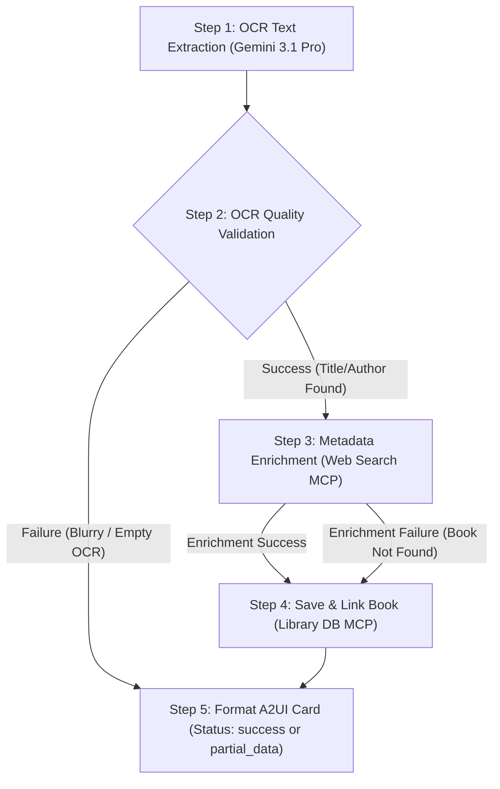

# Skill: process-book-photo

## Overview
This skill processes cover photos of books using high-accuracy OCR powered by Gemini 3.1 Pro, checks OCR quality, searches for books to enrich metadata, and saves the book to the user's library.

The execution flow of this skill is structured as a **Directed Acyclic Graph (DAG)** of sequential, isolated steps. This ensures that text extraction (OCR) and web search are completely separated.

---

## Input Schema
```yaml
type: object
properties:
  image_bytes:
    type: string
    format: byte
    description: "Base64 encoded cover photo image"
```

## Output Schema (A2UI Component)
```yaml
type: object
description: "A2UI Card payload matching frontend specifications"
properties:
  component:
    type: string
    enum: ["Card"]
  status:
    type: string
    enum: ["success", "manual_input_required", "partial_data", "quota_exceeded"]
  data:
    type: object
    properties:
      title: { type: string, nullable: true }
      author: { type: string, nullable: true }
      genre: { type: string, nullable: true }
      description: { type: string, nullable: true }
```

---

## Directed Acyclic Graph (DAG) Execution Flow



### Detailed DAG Steps

#### **Step 1 (Node A): OCR Text Extraction**
* **Input:** `image_bytes` (Base64 raw image)
* **LLM Model:** Gemini 3.1 Pro
* **Action:** Perform vision-based text extraction. Parse the title and author(s) from the book cover image.
* **Output:** `extracted_title` (string | null), `extracted_author` (string | null)

#### **Step 2 (Node B): OCR Quality Validation & Routing**
* **Input:** `extracted_title`, `extracted_author`
* **Action:** Check if the text extraction was successful.
  * If both `extracted_title` and `extracted_author` are null or empty (indicating blurry/unreadable cover):
    * Set final status to `"manual_input_required"`.
    * Route immediately to **Step 5 (Node E)**, skipping search and DB operations.
  * Otherwise:
    * Proceed to **Step 3 (Node C)**.

#### **Step 3 (Node C): Metadata Enrichment (Isolated Web Search)**
* **Input:** `extracted_title`, `extracted_author`
* **Tool Called:** `web-search-mcp.find_books_by_context(user_prompt: str, library_summary: str)`
  * *Argument Mapping:* Construct a search query (e.g. `extracted_title + " by " + extracted_author`) passed as `user_prompt`.
* **Action:** Query the custom web search MCP to retrieve the book's `genre` and `description`.
* **Output:**
  * **Enrichment Success:** `genre`, `description` (populated), status `"success"`.
  * **Enrichment Failure (Book Not Found / Search Error):** `genre: null`, `description: null`, status `"partial_data"`.

#### **Step 4 (Node D): Database Integration**
* **Input:** `extracted_title`, `extracted_author`, `genre`, `description`, `status` (from Step 3)
* **Tool Called:** `library-db-mcp.save_book(title, author, genre, description)`
  * *Security Warning:* The `user_id` is automatically injected at the gateway/infrastructure layer. The agent must **never** pass `user_id` parameters.
* **Action:** Save the book to the global database and link it to the user's library.
* **Output:** Save transaction confirmation.

#### **Step 5 (Node E): A2UI Card Formatting**
* **Input:** `extracted_title`, `extracted_author`, `genre`, `description`, final `status`
* **Action:** Format the final output matching the A2UI Card schema.
* **Output:** Strictly typed JSON payload matching the A2UI component specification.
